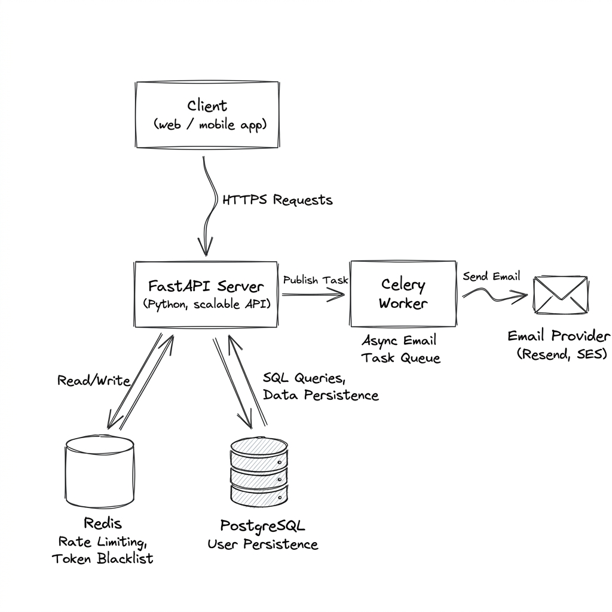

# Scalable User Service

A production-grade, highly-scalable user authentication and identity microservice built with **FastAPI**. It features stateless JWT authentication, Redis-backed caching & rate limiting, PostgreSQL persistence, and asynchronous background email dispatching via Celery.

---

## 🏗️ System Architecture

Below is the system design architecture diagram for the User Service (drawn in an Excalidraw style):



### Architectural Components

1. **Client (Web / Mobile App)**: Sends requests via HTTPS. For authenticated routes, it sends a stateless JSON Web Token (JWT) in the `Authorization` header.
2. **FastAPI Application Server**: High-performance ASGI web server utilizing `uvloop`. It handles routing, request validation, authentication checks, and rate limiting.
3. **PostgreSQL**: Used as the primary persistent database. Handles core user data (passwords, emails, verification state) using SQLAlchemy (via `asyncpg` for non-blocking I/O).
4. **Redis Cache & Revocation Store**:
   - **Caching**: Stores active user profiles (`user_id` -> JSON profile) to avoid hitting PostgreSQL on every authenticated request.
   - **Rate Limiting**: Uses a sliding window log/counter algorithm via `slowapi` to mitigate brute-force and DDoS attacks.
   - **JWT Blacklist**: Revokes JWTs on `/logout` or `/refresh` by blacklisting token identifiers (`jti`) until their natural expiry time.
5. **Celery Worker**: Asynchronous task queue that processes heavy operations (like sending verification and password reset emails) off the main request-response thread.
6. **Email Provider (Resend)**: Handles delivery of transactional emails (welcome, OTP verification, password resets).

---

## 🚀 Deployment (Docker Compose)

This service is fully dockerized and ready to deploy on any virtual machine (VM) with a single command. It runs two main containers:
- `user_service_api`: The FastAPI web server. Runs Alembic database migrations automatically upon start.
- `user_service_worker`: The Celery background task worker.

### Prerequisites

Ensure the VM has **Docker** and **Docker Compose** installed.

### Step-by-Step VM Deployment

1. **Clone/Pull the repository** to your VM:
   ```bash
   git clone https://github.com/itsVish16/Scalable_User_Service.git
   cd Scalable_User_Service
   ```

2. **Configure Environment Variables**:
   Create a `.env` file in the root directory:
   ```bash
   touch .env
   ```
   Add your database, redis, and email provider configurations. (See [Environment Configuration](#-environment-configuration) below for a list of variables).

3. **Spin up the stack**:
   ```bash
   docker compose up -d --build
   ```
   *This command will build the lightweight multi-stage image, auto-apply database migrations (`alembic upgrade head`), bind port `8000`, and start the background worker process.*

4. **Verify Deployment**:
   Verify that the API is responding to health checks:
   ```bash
   curl http://localhost:8000/health/live
   # Response: {"status":"alive"}
   ```
   Check system-wide health (database and redis connectivity):
   ```bash
   curl http://localhost:8000/health/ready
   ```

---

## ⚙️ Environment Configuration

Configure the service via a `.env` file in the root directory:

```env
# Database Settings
DATABASE_URL=postgresql+asyncpg://<user>:<password>@<host>:<port>/<dbname>
DB_POOL_SIZE=20
DB_MAX_OVERFLOW=10
DB_POOL_TIMEOUT=30

# Redis Cache Settings
REDIS_URL=rediss://default:<password>@<host>:<port>
REDIS_MAX_CONNECTIONS=100

# Celery Task Queue Settings
CELERY_BROKER_URL=redis://default:<password>@<host>:<port>/0
CELERY_RESULT_BACKEND=redis://default:<password>@<host>:<port>/1
CELERY_TASK_ALWAYS_EAGER=false

# Security & JWT Configuration
SECRET_KEY=your-production-strength-long-random-secret
ALGORITHM=HS256
ACCESS_TOKEN_EXPIRE_MINUTES=30
REFRESH_TOKEN_EXPIRE_MINUTES=10080

# Rate Limiting
ENABLE_RATE_LIMITING=true
RATE_LIMIT_SIGNUP=5/minute
RATE_LIMIT_LOGIN=10/minute
RATE_LIMIT_REFRESH=10/minute
RATE_LIMIT_FORGOT_PASSWORD=5/minute
RATE_LIMIT_RESET_PASSWORD=5/minute
RATE_LIMIT_VERIFY_EMAIL=5/minute
RATE_LIMIT_RESEND_VERIFICATION=5/minute

# External Email Provider
RESEND_API_KEY=re_your_api_key_here
EMAIL_FROM=user_service@yourdomain.com
FRONTEND_BASE_URL=https://your-frontend-domain.com

# General settings
DEBUG=false
```

---

## 🛡️ Production & Performance Optimizations

- **Bcrypt Concurrency Control**: Computations for password hashing are capped inside a worker-level capacity limiter to prevent CPU starvation when many logins hit simultaneously.
- **Fast Database Release**: DB connections are returned to the pool *before* performing heavy bcrypt checks, protecting pool throughput under heavy traffic spikes.
- **Stateless Tokens**: The refresh token flow incorporates token reuse detection (blacklisting old ones immediately) and automatically invalidates compromised login sessions.
- **FastAPI Standard Multi-Stage Build**: The `Dockerfile` uses a two-stage build to compile dependencies with `uv` and runs on a minimal Python runtime image to keep VM resources light.

---

## 🧪 Running Tests Locally

This project uses `uv` for local dependency management.

1. **Install dependencies**:
   ```bash
   uv sync
   ```

2. **Run the test suite**:
   ```bash
   uv run pytest
   ```
