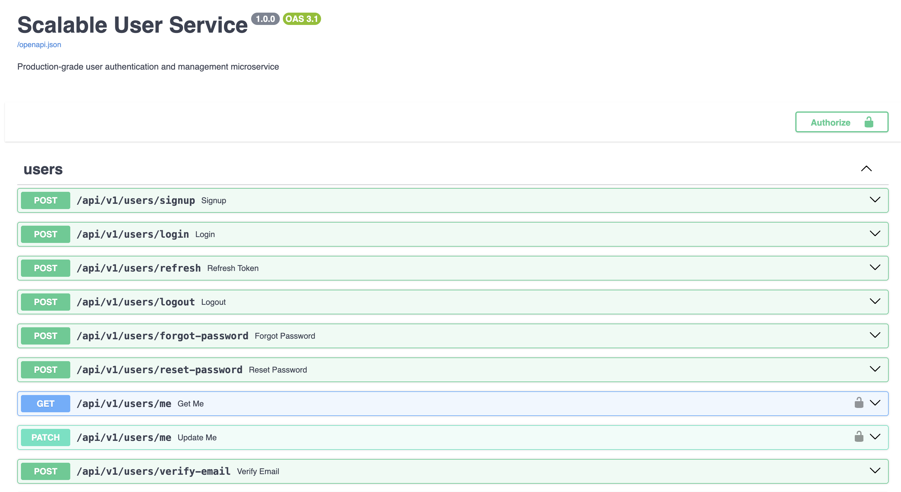

# 🚀 Scalable User Service



A production-grade, high-performance User Microservice built with **FastAPI**, **PostgreSQL**, and **Redis**. Designed to handle massive traffic spikes with aggressive caching, asynchronous background tasks, and cloud-native resilience patterns.

---

## ✨ Key Features

### 🔐 Security & Auth
- **JWT-based Authentication**: Secure access and refresh token flows with `jti` claim validation.
- **Async Password Hashing**: Bcrypt operations are offloaded to a dedicated thread pool to prevent event loop starvation.
- **Account Lockout**: Automated protection against brute-force attacks (5 failed attempts = 15-minute lockout).
- **Token Blacklisting**: Real-time token revocation on logout and refresh.

### ⚡ Performance & Scaling
- **Aggressive Redis Caching**: The `/me` profile endpoint is optimized for sub-10ms response times via intelligent caching.
- **Fail-Fast Load Shedding**: Reduced database connection pool timeouts to prevent cascading failures under heavy load.
- **Asynchronous Workflows**: Email delivery and heavy tasks are handled by **Celery** workers to keep the API layer stateless and fast.

### 🛠️ Developer Experience
- **Cloud-Native Health Checks**: Split `/health/live` (liveness) and `/health/ready` (readiness) probes for seamless Kubernetes/Docker integration.
- **Observability**: Structured JSON logging, Request IDs, and Prometheus metrics at `/metrics`.
- **Modern Tooling**: Built with `uv` for lightning-fast dependency management and `ruff` for strict linting.

---

## 🏗️ Architecture

```text
app/
├── api/                # Route handlers (v1)
├── core/               # Security, Logging, Metrics, Rate Limiting
├── db/                 # Postgres & Redis Engine setup
├── middleware/         # Structured Logging & Prometheus Middleware
├── models/             # SQLAlchemy (SQL) Data Models
├── schemas/            # Pydantic (JSON) Validation Schemas
├── services/           # Business Logic & Cache Providers
└── tasks/              # Celery App & Background Workers
```

---

## 🚀 Getting Started

### 1. Prerequisites
- [Docker & Docker Compose](https://docs.docker.com/get-docker/)
- [Python 3.13+](https://www.python.org/)
- [uv](https://github.com/astral-sh/uv) (Recommended)

### 2. Environment Setup
Copy the example environment file and fill in your secrets:
```bash
cp .env.example .env
```

### 3. Run with Docker (Recommended)
The easiest way to start the full stack (API + Worker + DB + Redis):
```bash
docker compose up --build
```
The API will be available at `http://localhost:8000`.

### 4. Local Development
If you prefer running without Docker:
```bash
# Install dependencies
uv sync

# Apply database migrations
uv run alembic upgrade head

# Start the API
uv run uvicorn app.main:app --reload

# Start the Celery Worker (In a new terminal)
uv run celery -A app.tasks.celery_app.celery_app worker --loglevel=info
```

---

## 🚦 Useful Endpoints

| Endpoint | Method | Description |
| :--- | :--- | :--- |
| `/api/v1/users/signup` | `POST` | Create a new account |
| `/api/v1/users/login` | `POST` | Authenticate & get JWT tokens |
| `/api/v1/users/me` | `GET` | Get current user (Cached) |
| `/health/live` | `GET` | Process liveness check |
| `/health/ready` | `GET` | Dependency readiness check |
| `/metrics` | `GET` | Prometheus telemetry |

---

## 🧪 Testing

### Unit & Integration Tests
We maintain a 100% green test suite covering all critical auth and scaling paths.
```bash
uv run pytest
```

### Load Testing
The project includes a `locustfile.py` to simulate high-concurrency traffic.
```bash
# 1. Setup test data
uv run setup_test_data.py

# 2. Run Locust
uv run locust --headless -u 1000 -r 100 --run-time 1m --host=http://localhost:8000
```

---

## 📜 License
This project is licensed under the MIT License.
